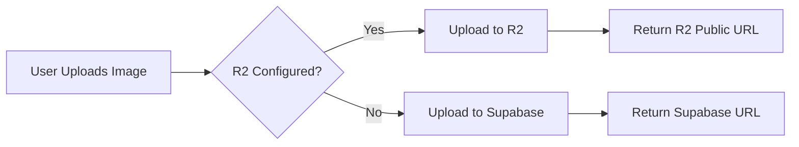
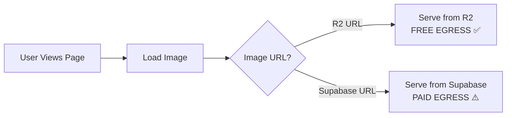

# Cloudflare R2 Public Access Setup Guide

## 🎯 Goal
Enable free egress on your R2 bucket so images are served directly from R2 with zero bandwidth costs.

## 📊 Cost Savings
- **Before**: Supabase egress = $2,772/month (10K users)
- **After**: R2 egress = $0/month ✅
- **Total Monthly Cost**: ~$90/month (just storage + operations)

---

## Step 1: Enable Public Access in Cloudflare Dashboard

1. Go to [Cloudflare Dashboard](https://dash.cloudflare.com/)
2. Navigate to: **R2 Object Storage** > **impact-images** bucket
3. Scroll to **"Public Development URL"** section
4. Click **"Enable"** button
5. **Copy the generated URL** - it will look like:
   ```
   https://pub-XXXXXXXXXXXXX.r2.dev
   ```
6. ⚠️ **IMPORTANT**: Keep this URL handy for the next steps

### Alternative: Use Custom Domain (Optional - for production)

If you want a branded URL like `images.impactrd.org`:

1. In the **"Custom Domains"** section, click **"Add Custom Domain"**
2. Enter your domain: `images.impactrd.org`
3. Add the DNS records Cloudflare provides
4. Use this custom domain as your `VITE_R2_PUBLIC_URL`

---

## Step 2: Update Local Environment Variables

1. **Create `.env.local` file** in your project root:

```bash
# Supabase Configuration
VITE_SUPABASE_URL=https://your-project.supabase.co
VITE_SUPABASE_ANON_KEY=your_anon_key_here

# Cloudflare R2 Configuration
VITE_R2_ACCOUNT_ID=28eec24bb9bab22e118ae4ba787be7e2
VITE_R2_ACCESS_KEY_ID=your_access_key_id
VITE_R2_SECRET_ACCESS_KEY=your_secret_access_key
VITE_R2_BUCKET_NAME=impact-images

# ⭐ REPLACE THIS with your actual R2.dev URL from Step 1
VITE_R2_PUBLIC_URL=https://pub-XXXXXXXXXXXXX.r2.dev

# Sentry (optional)
VITE_SENTRY_DSN=
VITE_SENTRY_ENVIRONMENT=development
```

2. **Replace** `https://pub-XXXXXXXXXXXXX.r2.dev` with your actual public URL

---

## Step 3: Update Netlify Environment Variables

1. Go to [Netlify Dashboard](https://app.netlify.com/)
2. Select your **impact-rd** site
3. Navigate to: **Site configuration** > **Environment variables**
4. **Add/Update** the following variable:

   | Key | Value |
   |-----|-------|
   | `VITE_R2_PUBLIC_URL` | `https://pub-XXXXXXXXXXXXX.r2.dev` |

5. **Deploy** the site to apply changes

---

## Step 4: Test Your Setup

### Test 1: Verify R2 is Active

Run this in your browser console on your site:

```javascript
// Check if R2 is configured
console.log('R2 Configured:', import.meta.env.VITE_R2_PUBLIC_URL ? 'YES ✅' : 'NO ❌');
console.log('R2 Public URL:', import.meta.env.VITE_R2_PUBLIC_URL);
```

### Test 2: Upload a Test Image

1. Go to **Admin Panel** > **News** or **Highlights**
2. **Upload a new image**
3. Check the browser console - you should see:
   ```
   [R2] Uploading test.jpg to news/...
   [R2] Upload successful: https://pub-XXXXX.r2.dev/news/1234567890-abc123.jpg
   ```
4. **View the uploaded image** - it should load from R2

### Test 3: Verify Free Egress

1. Open **Network tab** in browser DevTools
2. Reload a page with images
3. Check image URLs - they should be:
   ```
   https://pub-XXXXX.r2.dev/...
   ```
   NOT:
   ```
   https://xxx.supabase.co/storage/...
   ```

---

## How It Works

### Upload Flow



### Access Flow



---

## Migration Strategy

### New Uploads
✅ **Automatic** - All new uploads go to R2 (already implemented)

### Existing Images
You have 2 options:

#### Option A: Lazy Migration (Recommended)
- Leave old images in Supabase
- Monitor egress usage
- Migrate manually if costs increase

#### Option B: Bulk Migration
- Download all images from Supabase
- Re-upload to R2
- Update database URLs
- Delete from Supabase

---

## Troubleshooting

### Issue: "Public access is not enabled"

**Solution**: You forgot to enable the Public Development URL in Step 1

### Issue: Images not loading from R2

**Solution**: 
1. Check `VITE_R2_PUBLIC_URL` in your `.env.local`
2. Make sure it's deployed to Netlify
3. Verify the URL is correct (no trailing slash)

### Issue: CORS errors

**Solution**: Add CORS policy in R2 bucket settings:

```json
[
  {
    "AllowedOrigins": ["*"],
    "AllowedMethods": ["GET", "HEAD"],
    "AllowedHeaders": ["*"],
    "ExposeHeaders": [],
    "MaxAgeSeconds": 3600
  }
]
```

### Issue: 404 on image URLs

**Solution**: 
1. Verify the bucket name is `impact-images`
2. Check that images were actually uploaded to R2 (check browser console)
3. Verify public access is enabled

---

## Security Considerations

### Public Access = Safe ✅

- ✅ **Read-only** access - users can only view images
- ✅ **No listing** - users can't browse all images
- ✅ **No writes** - only your API keys can upload
- ✅ **No deletions** - only your API keys can delete

### API Keys = Secure 🔒

- 🔒 **Never commit** `.env.local` to git
- 🔒 **Use Netlify** environment variables for production
- 🔒 **Rotate keys** if ever exposed
- 🔒 **Limit permissions** on R2 API tokens

---

## Cost Breakdown (10K Users)

| Service | Monthly Cost |
|---------|--------------|
| R2 Storage (10GB) | ~$0.15 |
| R2 Class A Ops (1M) | $4.50 |
| R2 Class B Ops (10M) | $0.36 |
| **R2 Egress** | **$0.00** ✅ |
| Supabase Pro | $25 |
| Netlify Pro (if needed) | $19 |
| **TOTAL** | **~$49/month** |

Compare to Supabase-only: **$2,772/month** 💸

**Savings**: **$2,723/month** or **98.2%** 🎉

---

## Next Steps

1. ✅ Enable Public Development URL (do this NOW)
2. ✅ Copy the R2.dev URL
3. ✅ Update `.env.local`
4. ✅ Update Netlify env vars
5. ✅ Test by uploading an image
6. ✅ Verify egress is free

---

## Support

If you run into issues:

1. Check browser console for errors
2. Verify all env variables are set
3. Test with a fresh upload
4. Check Cloudflare R2 metrics

**Need help?** Open an issue with:
- Browser console logs
- Network tab screenshots
- Error messages
