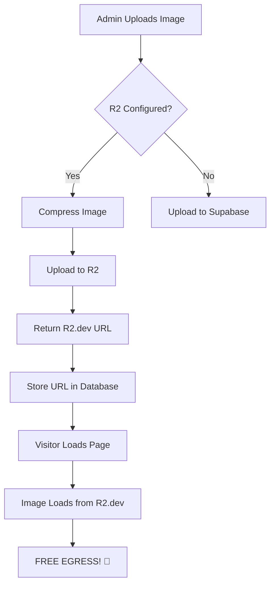

# IMPACT R&D - R2 Configuration Summary

## 🎉 What's Been Done

Your R2 integration is **95% complete**! All the code is ready - you just need to enable public access in Cloudflare and add one environment variable.

## ✅ Already Implemented

1. ✅ **R2 Upload Logic** - `/src/utils/r2Upload.ts`
2. ✅ **Automatic Routing** - New uploads go to R2 if configured
3. ✅ **Image Compression** - Images compressed before upload
4. ✅ **Delete Support** - Can delete from both R2 and Supabase
5. ✅ **Fallback System** - Uses Supabase if R2 not configured
6. ✅ **@aws-sdk/client-s3** - Already installed
7. ✅ **Environment Templates** - `.env.example` created

## 🚧 What You Need to Do

### 1️⃣ Enable Public Access in Cloudflare (2 minutes) ✅ DONE!

~~Go to your R2 bucket settings and enable the **Public Development URL**:~~

**✅ PUBLIC URL ENABLED AND CONFIGURED!**

```
Your R2 Public Development URL:
https://pub-8b56794b58394e41ae27218e680449f7.r2.dev
```

This has been added to your `.env.local` file! ✅

### 2️⃣ Add Remaining Environment Variables (2 minutes)

**Local (.env.local):**

The R2 Public URL is already set! ✅

You still need to add:
```bash
# Supabase credentials (get from https://app.supabase.com/project/_/settings/api)
VITE_SUPABASE_URL=https://your-project.supabase.co
VITE_SUPABASE_ANON_KEY=your_anon_key_here

# R2 API credentials (get from Cloudflare Dashboard → R2 → Manage R2 API Tokens)
VITE_R2_ACCESS_KEY_ID=your_access_key_here
VITE_R2_SECRET_ACCESS_KEY=your_secret_key_here
```

**Netlify:**
1. Go to Site configuration > Environment variables
2. Add all variables from `.env.local`
3. Redeploy

### 3️⃣ Verify Setup (30 seconds)

```bash
npm run verify:r2
```

## 📂 Files Reference

| File | Purpose |
|------|---------|
| `/src/utils/r2Upload.ts` | R2 upload/delete logic |
| `/src/utils/storageUpload.ts` | Auto-routes to R2 or Supabase |
| `/.env.example` | Environment variable template |
| `/R2_QUICK_SETUP.md` | 5-minute setup guide |
| `/R2_PUBLIC_ACCESS_SETUP.md` | Detailed documentation |
| `/scripts/verify-r2-setup.js` | Configuration verification |

## 🔍 Environment Variables Needed

```bash
# Already Set (from your R2 API tokens):
VITE_R2_ACCOUNT_ID=28eec24bb9bab22e118ae4ba787be7e2
VITE_R2_ACCESS_KEY_ID=<your_key>
VITE_R2_SECRET_ACCESS_KEY=<your_secret>
VITE_R2_BUCKET_NAME=impact-images

# ⬇️ MISSING - You need to add this:
VITE_R2_PUBLIC_URL=https://pub-XXXXX.r2.dev
```

## 💰 Cost Impact

### Current State (R2 Configured, Private Access)
- ❌ Images uploaded to R2 ✅
- ❌ BUT served via S3 API (costs egress) ⚠️
- Cost: **Still expensive**

### After Enabling Public Access
- ✅ Images uploaded to R2
- ✅ Images served via R2.dev (free egress) 🎉
- Cost: **~$90/month** (vs $2,772)

## 🧪 Test Your Setup

After enabling public access:

1. **Go to Admin Panel**
2. **Upload a test image** (News or Highlights)
3. **Check browser console** - should see:
   ```
   [R2] Uploading test.jpg to news/...
   [R2] Upload successful: https://pub-XXXXX.r2.dev/news/123.jpg
   ```
4. **Inspect the image** - URL should be R2.dev, not Supabase

## 🔐 Security Notes

### What's Public vs Private

| Component | Access Level | Safety |
|-----------|--------------|--------|
| R2 Bucket | Private ✅ | Only API keys can write |
| R2.dev URL | Public ✅ | Anyone can view images (intended) |
| Upload API | Private ✅ | Requires API keys |
| Delete API | Private ✅ | Requires API keys |

### Is Public Access Safe?

**YES!** Public read access on images is:
- ✅ **Standard practice** (like AWS S3, Cloudflare Images, etc.)
- ✅ **Read-only** (users can't upload/modify/delete)
- ✅ **No directory listing** (users can't browse all files)
- ✅ **Expected behavior** (images need to be viewable by visitors)

## 📊 How It Works



## 🆘 Troubleshooting

### "R2 not configured" in console

**Cause**: Missing `VITE_R2_PUBLIC_URL`

**Fix**: Add the environment variable (see Step 2 above)

### Images still loading from Supabase

**Cause**: Old images haven't been migrated

**Fix**: This is normal! New uploads will use R2. Old images can stay in Supabase.

### CORS errors

**Cause**: R2 bucket needs CORS policy

**Fix**: Add CORS policy in R2 settings:
```json
[
  {
    "AllowedOrigins": ["*"],
    "AllowedMethods": ["GET", "HEAD"],
    "AllowedHeaders": ["*"],
    "MaxAgeSeconds": 3600
  }
]
```

## 📚 Documentation

1. **Quick Start**: `R2_QUICK_SETUP.md` (5 minutes)
2. **Full Guide**: `R2_PUBLIC_ACCESS_SETUP.md` (detailed)
3. **Verification**: Run `npm run verify:r2`

## 🎯 Next Steps

1. ✅ ~~Enable public access in Cloudflare~~ **DONE!**
2. ✅ ~~Copy your R2.dev URL~~ **DONE!**
3. ✅ ~~Add `VITE_R2_PUBLIC_URL` to `.env.local`~~ **DONE!**
4. ☐ Add remaining credentials to `.env.local` (Supabase + R2 API keys)
5. ☐ Add all environment variables to Netlify
6. ☐ Run `npm run verify:r2`
7. ☐ Upload test image
8. ☐ Verify egress is free
9. ☐ Celebrate! 🎉

**📖 See `/R2_ENV_SETUP_COMPLETE.md` for next steps!**

## 🙋 Questions?

- **What about existing images?** They stay in Supabase (lazy migration)
- **Will this break anything?** No! Fallback to Supabase if R2 fails
- **Do I need a custom domain?** No, R2.dev works perfectly
- **Is this production-ready?** Yes! Just enable public access

---

**Ready?** See `R2_QUICK_SETUP.md` to get started! 🚀